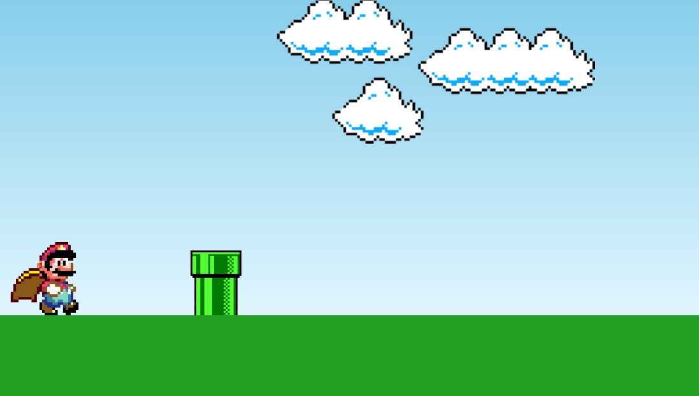

# mario-jump

Jogo Simples do Mario

<<<<<<< HEAD
<h4 align="center"><a href="https://mario-jump.vercel.app/">Clique para visitar o projeto</a></h4>

## 🎯 Objetivo

Projeto base desenvolvido através do tutorial do [Manual do Dev](https://www.youtube.com/watch?v=r9buAwVBDhA). É um jogo onde é possível pular obstáculos, e ele termina quando você colide com algum obstáculo.

## 🛠️ Tecnologias utilizadas

Para o desenvolvimento deste site utilizei as seguintes tecnologias:

- HTML;
- CSS;
- JavaScript;

## ⚙️ Ajustes e melhorias

Adicionei ao projeto as seguintes funcionalidades:

- ✔️ Som do jogo
- ✔️ Modal Game Over
=======
Tutorial: https://www.youtube.com/watch?v=r9buAwVBDhA

Adicionei ao projeto as seguintes funcionalidades: 

- [x] Som do jogo
- [x] Modal Game Over
>>>>>>> 2ab7d0d7c7b465ad453c8e950f378d8926217975
